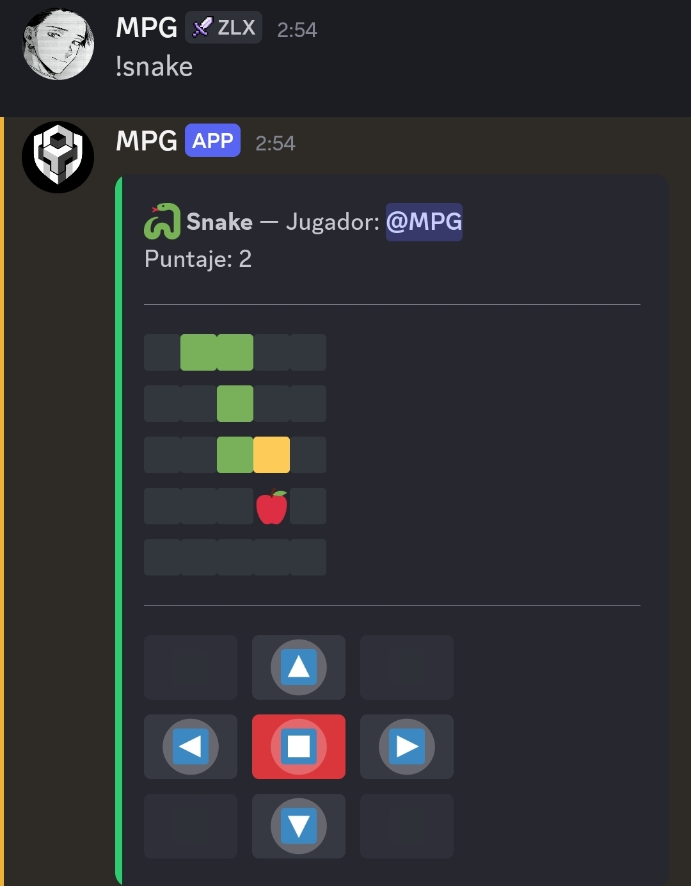

# 🐍 Snake para Discord — BDFD + CV2

[¿Qué es esto?](https://github.com/mpg-perto/Snake-BDFD/tree/main#qu%C3%A9-es-esto)

[¿De qué sirve / cómo funciona por dentro?](https://github.com/mpg-perto/Snake-BDFD/tree/main#de-qu%C3%A9-sirve--c%C3%B3mo-funciona-por-dentro)

[Cómo usar este repositorio](https://github.com/mpg-perto/Snake-BDFD/blob/main/README.md#c%C3%B3mo-usar-este-repositorio)



## ¿Qué es esto?

Un juego de **Snake** jugable directamente dentro de Discord, hecho con **Bot Designer For Discord (BDFD)** y los **componentes CV2**.

Se juega con el comando `!snake`, que dibuja un tablero 5x5 y una cruz de botones (⬆️⬅️⏹️➡️⬇️) debajo. Cada jugador tiene su propia partida, guardada por su ID de usuario, y **solo esa persona puede tocar sus botones**.

## ¿De qué sirve / cómo funciona por dentro?

- **El tablero (5x5 = 25 celdas)** se construye con 25 bloques `$if/$elseif/$else` repetidos manualmente, no con un loop. Cada celda se compara contra la posición de la serpiente y de la manzana usando `$textSplit` + `$getTextSplitIndex`.
- **La serpiente** se guarda como un string tipo `"3,3|3,2|3,1"` (cabeza primero, segmentos separados por `|`). Moverse es anteponer una cabeza nueva y — si no comió manzana — quitar la cola con `$removeSplitTextElement`.
- **Las colisiones** (con la pared o con el propio cuerpo) se detectan comparando la nueva posición de la cabeza contra los límites del tablero y contra el resto del cuerpo.
- **La manzana** aparece en una celda al azar que no esté ocupada por la serpiente. Si el sorteo choca 3 veces seguidas, se hace un barrido completo y determinista de las 25 celdas para garantizar que siempre aparezca en algún lugar libre (nunca "desaparece").
- **Cuando la serpiente llena las 25 celdas**, no es game over: vuelve a su tamaño inicial y sigue jugando, pero **el puntaje nunca se reinicia** — sigue acumulando indefinidamente.
- **Seguridad por dueño de partida:** cada botón lleva el ID del dueño incrustado en su `customID` (`snake-up-123456789`, por ejemplo). Cuando alguien más hace click, el bot lo detecta y responde que no puede usar esa partida, sin tocar el estado del juego.

## Cómo usar este repositorio

1. Entra a tu bot en BDFD.
2. Crea un comando de texto `!snake` y pega dentro el contenido de [`Codigos/!snake.md`](Codigos/!snake.md) (solo el bloque de código, sin los ``` de markdown).
3. Crea un comando con el trigger `$onInteraction` (sin ID entre corchetes, para que capture todos los botones) y pega el contenido de [`Codigos/$onInteraction.md`](Codigos/$onInteraction.md).
4. Antes de probarlo, crea estas 5 variables en el panel de BDFD (pestaña *Variables*):
   - `snake_body`
   - `snake_dir`
   - `snake_apple`
   - `snake_score`
   - `snake_alive`
5. Guarda, prende el bot y ejecuta `!snake` en tu servidor.
